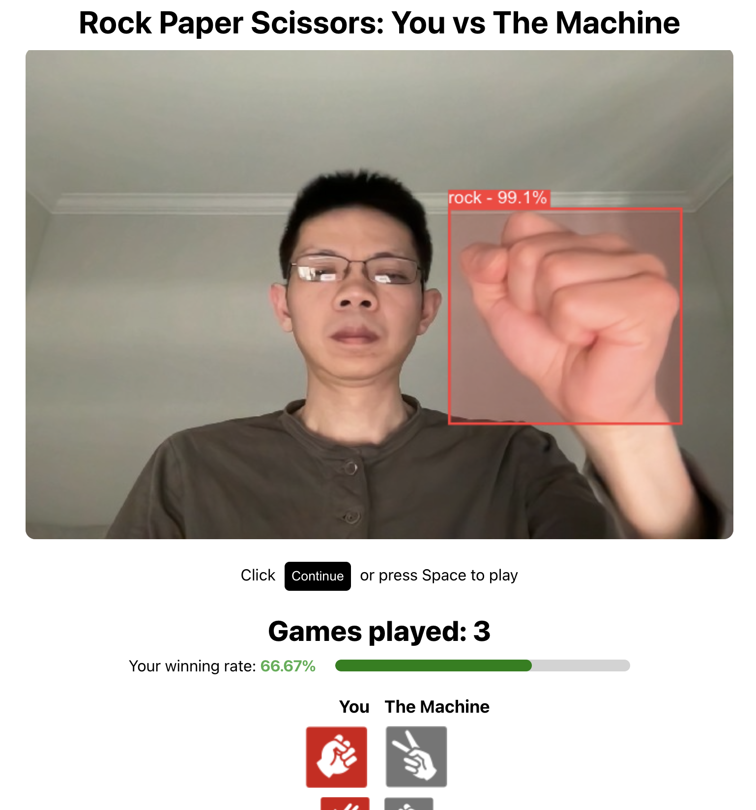

# Rock Paper Scissors

Play Rock Paper Scissors against a computer opponent, right inside your browser.

Using YOLOv10 in browser with onnxruntime-web and `wasm` backend.


<p align="center">
  
</p>

## Setup

```bash
git clone https://github.com/research-triangle-ai/rock-paper-scissors.git
cd rock-paper-scissors
npm install # Install dependencies
```

## Scripts

```bash
npm run start # Start dev server
npm run build # Build for productions
```

## Reference

- https://github.com/THU-MIG/yolov10
- https://github.com/Hyuto/yolov10-onnxruntime-web
